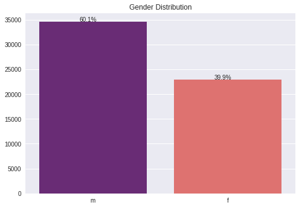
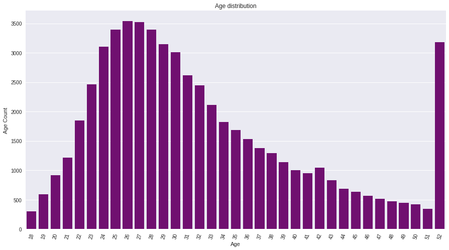
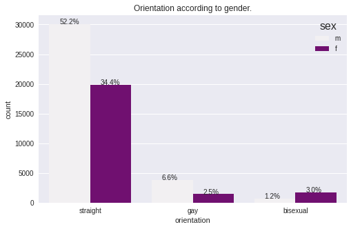

# Pata Mchumba Dating-App-Recommender

https://user-images.githubusercontent.com/71583548/190932190-cfe2122d-d84d-4cb0-8b77-830ad622b640.mp4

## Group Members
<ol>
<li> Iain Mosima </li>
<li> Benson Muriu </li>
<li> Elsie Kiprop </li>
<li> Fred Mutuma </li>
<li> Peter Kigotho </li>
<li> Oscar Karuga </li>
</ol>

## 1.1 Business Understanding

 With the current generation embracing technology and its applications, many people have become accustomed to the idea of using dating apps. Therefore, Pata Mchumba,  a dating company, has approached us to create a recommendation system for their users to increase the effectiveness of matches based on their preferences. Moreover our recommender will focus mainly on emotional connection rather than physical appearance.

## 1.2 Objectives
### Main Objective:
<li> To build a dating app recommender system that successfully maximises the matches. </li>

### Specific Objectives

## 1.3 Data Understanding

 Our data was sourced from https://www.tandfonline.com/doi/abs/10.1080/10691898.2015.11889737.

 We considered the ethical concerns and no rights were infringed in the collection of this data as OKCupid provided this data for use by the public. 

 The data contained 31 rows and 59964 columns. 

### Column names and description 

<ol>
 <li> age          : How old the person is </li>
 <li> status       : The person's relationship status (e.g. single, divorced, etc.) </li>
 <li> sex          : The person's biological sex (e.g. male, female, etc.) </li>
 <li> orientation  : The person's sexual orientation (e.g. straight, gay, etc.) </li>
 <li> body_type    : The person's body type (e.g. slim, average, etc.) </li>
 <li> diet         : The person's diet (e.g. vegetarian, non-vegetarian, etc.)</li>
 <li> drinks       : The person's drinking habits (e.g. social drinker, heavy drinker, etc.)</li>
<li>  drugs        : The person's drug habits (e.g. never, occasionally, etc.)</li>
 <li> education    : The person's educational attainment (e.g. high school, college, etc.)</li>
 <li> ethnicity    : The person's ethnic background (e.g. Hispanic, Asian, etc.)</li>
 <li> height       : The person's height in inches</li>
 <li> income       : The person's annual income</li>
 <li> job          : The person's current job (e.g. doctor, lawyer, etc.)</li>
 <li> last_online  : The date the person was last active on the website</li>
 <li> location     : The person's current city</li>
 <li> offspring    : The person's desire to have children</li>
 <li> pets         : The person's pet preferences (e.g. dog, cat, etc.)</li>
 <li> religion     : The person's religious beliefs</li>
 <li> sign         : The person's astrological sign</li>
 <li> smokes       : The person's smoking habits (e.g. nonsmoker, occasional smoker, etc.)</li>
</ol>

 essay columns 

<ol start='21'>
<li> essay 0: My self summary </li>
<li> essay 1: What I’m doing with my life </li>
<li> essay 2: I’m really good at... </li>
<li> essay 3: The first thing people usually notice about me... </li>
<li> essay 4: Favourite books, movies, show, music, and food </li>
<li> essay 5: The six things I could never do without </li>
<li> essay 6: I spend a lot of time thinking about... </li>
<li> essay 7: On a typical Friday night I am... </li>
<li> essay 8: The most private thing I am willing to admit... </li>
<li> essay 9: You should message me if... </li>
</ol>

## 1.4 Problem Questions
<ol>
 <li> What is the gender distribution of the users? </li>
 <li> What is the age distribution of the users? </li>
 <li> What is the orientation distribution of the users? </li>
 <li> What is the frequency distribution of the consumption of drugs, alcohol and smoking? </li>
</ol> 

## 1.5 Data Preparation
### Data cleaning

The Dataset had 273202 missing values 

 The Dataset had no duplicated values hence it's consistent 

## 1.6 Modelling 

This final model will be a hybrid one. This will includes the above model and a model that matches users depending on the essays. It is created by checking for sentence similarity in the essays provided by each user.

## 1.7 Evaluation 

## 1.8 Conclusions
### EDA
<ol>
 <li> Q. What is the gender distribution of the users? </li>
 
 
A. From the above plot majority of the users are male at 60.1% and female follow closely at 39.9%

 
 <li> Q. What is the age distribution of the users? </li>
 
 
A. Majority of the users are between 22 and 35. However there seems to be odd ages on the dating site such as 109.

 
 
A. Majority of the users of this app are male. Most of them are aged 23 to 28. That same age bracket holds the highest number of female users.

 
 <li> Q. What is the orientation distribution of the users? </li>
 
 
A. Majority of the users are of the orientation straight. Most of the straight users are male. This is the same case for the gay orientation For the bisexual orientation, majority are female.

 
 <li> Q. What is the frequency distribution of the consumption of drugs, alcohol and smoking? </li>
 
A.

</ol> 

### Conclusions 
<ol>
<li>Majority of the users on dating sites are male.</li>
<li>On the other hand most of them are of the orientation straight.</li>
<li>It is evident that most of the people who sort out to using dating apps are young people.Mostly from 23-35 years of age.</li>
</ol>

## 1.9 Recommendations
<ol>
<li>Words being a way to one's heart makes this system less superficial oriented.</li>
<li>More personalized matches that replaces the traditional swipe or like to match.</li>
<li>Dealing with unspecified description in profiles to maximize matches.</li>
</ol>

